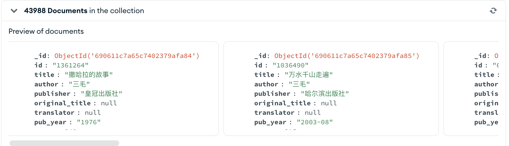
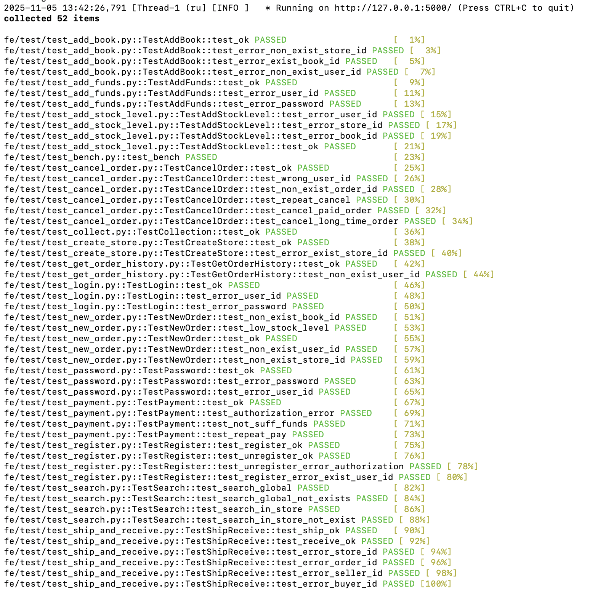

# 第一次大作业实验报告

## 小组成员：

曹璐 10223360419 负责基础代码修改，执行测试，新功能修改，实验报告

董涵 负责数据导入，调试代码，执行测试，编写新功能
## 1 数据库概览

本系统使用 MongoDB 作为后端数据库，使用 MongoClient 持久连接进行操作,数据库名称为 bookstore，包含以下主要集合：

## 1.1 数据库连接设计

系统在`store.py`中建立与MongoDB的连接：

```python
class MongoDB_client:
    def __init__(self):
        self.socket = pymongo.MongoClient(uri, server_api=pymongo.server_api.ServerApi('1'))
        self.check_and_delete_database('bookstore')
        self.database = self.socket['bookstore']
```

## 1.2 集合

### 1.2.1 user

存储用户信息，包括登录凭证、账户余额等，包括买家与卖家。

**Schema结构**:
```javascript
{
  "user_id": String,         // 用户唯一标识
  "password": String,        // 用户密码
  "balance": Number,         // 用户余额
  "token": String,           // JWT授权令牌
  "terminal": String,        // 登录设备标识
  "created_at": Number,      // 账户创建时间戳
  "last_login": Number,      // 最后登录时间戳
  "logout_time": Number      // 登出时间戳
}
```

**索引**:
```javascript
{ "user_id": 1 }  // 升序索引，提高查询效率
```

### 1.2.2 user_store集合

存储用户与商店的对应关系，一个用户可以拥有一个或多个商店。

**Schema结构**:
```javascript
{
  "store_id": String,        // 商店唯一标识
  "user_id": String,         // 店主用户id
  "status": String,          // 商店状态(active/inactive)
  "created_at": Number       // 创建时间戳
}
```

**索引**:
```javascript
{ "user_id": 1, "store_id": 1 }  // 联合索引，升序
```

### 1.2.3 store集合

存储商店信息及其销售的书籍。

**Schema结构**:
```javascript
{
  "book_id": String,         // 图书唯一标识
  "store_id": String,        // 商店id
  "book_info": String,       // 图书详细信息(JSON）
  "stock_level": Number,     // 库存
  "created_at": Number,      // 创建时间戳
  "updated_at": Number       // 更新时间戳
}
```

**索引**:
```javascript
{ "book_id": 1, "store_id": 1 }  // 复合索引，快速定位某商店的某本书，提高查询和库存操作效率
```

### 1.2.4 new_order集合

存储新生成的订单信息及订单状态。

**Schema结构**:
```javascript
{
  "order_id": String,        // 订单唯一标识
  "user_id": String,         // 买家的id
  "store_id": String         // 商店id
}
```

### 1.2.5 new_order_detail集合

存储订单明细信息，每个订单对应若干条书籍购买记录。

**Schema结构**:
```javascript
{
  "order_id": String,        // 订单id
  "book_id": String,         // 图书id
  "count": Number,           // 购买数量
  "price": Number            // 商品总价
}
```

### 1.2.6 order_history集合

存储历史订单记录

**Schema结构**:
```javascript
{
  "order_id": String,        // 订单唯一标识
  "user_id": String,         // 购买者用户id
  "store_id": String,        // 商店id
  "status": String,          // 订单状态：pending/paid/shipped/received/cancelled
  "created_at": Number,      // 创建时间戳
  "paid_at": Number,         // 支付时间戳
  "shipped_at": Number       // 发货时间戳
}
```

### 1.2.7 order_history_detail集合

存储历史订单的详细商品信息。

**Schema结构**:
```javascript
{
  "order_id": String,        // 订单id
  "book_id": String,         // 图书id
  "count": Number,           // 购买数量
  "price": Number            // 商品总价
}
```
### 1.3 性能优化

1. **设置索引**：在`user_id`、`book_id`和`store_id`等频繁需要查询的字段上创建好索引，提升查询效率。

2. **文档结构**：采用合理的嵌套结构和引用，避免过度嵌套导致的性能问题。

3. **记录时间**：在发生更新、创建等关键操作时记录时间戳，便于业务追踪。

## 2 数据量及测试数据说明

使用数据集book_lx.db，共计4万多条文档，已率先导入本地创建的MongoDB数据库中，用于测试。
```python
sqlite_cursor.execute('SELECT * FROM book')
rows = sqlite_cursor.fetchall()

for row in rows:
        db['books'].insert_one({
            'id': row[0],
            'title': row[1],
            'author': row[2],
            'publisher': row[3],
            'original_title': row[4],
            'translator': row[5],
            'pub_year': row[6],
            'pages': row[7],
            'price': row[8],
            'currency_unit': row[9],
            'binding': row[10],
            'isbn': row[11],
            'author_intro': row[12],
            'book_intro': row[13],
            'content': row[14],
            'tags': row[15],
            'picture': row[16],
        })
```


## 3 功能实现

### 3.1 用户

*   **实现原理**

    1.JWT 认证原理
    - JWT 是一种基于 JSON 的开放标准（RFC 7519），用于在客户端与服务器之间安全传递信息。
    - user.py 模块通过 HS256 算法对用户信息签名，实现 token 的生成与验证。
    - token payload 包含 user_id、终端标识 terminal 和时间戳 timestamp。

    2.MongoDB 数据存储
    - 用户数据存储在 user 集合中，包括用户 ID、密码、余额、token、终端信息及时间戳。
    - 使用 pymongo 对数据库进行增删查改操作，实现用户信息管理。

    2.用户认证与安全机制
    - 登录时生成新的 token 并更新数据库，保证同一账户在不同终端的安全性。
    - Token 有有效期（3600 秒），超过时间需重新登录。
    - 注销操作会生成临时 token，使原 token 失效，提高安全性。
*   **模块结构**

| 模块                | 功能                                              |
| ----------------- | ----------------------------------------------- |
| `generate_token`  | 根据 `user_id` 和 `terminal` 生成 JWT token          |
| `verify_token`    | 验证并解析 token，返回 payload                          |
| `User` 类          | 封装用户操作，包括注册、登录、注销、密码管理、搜索书籍                     |
| `_handle_error`   | 统一错误处理与日志记录                                     |
| `_validate_token` | 校验 token 是否有效                                   |
| 数据库访问             | 基于 `pymongo` 对 `user`、`books`、`store` 集合进行 CRUD |

*   **核心代码**
    - 搜索书籍
    ```python
    def search_book(self, title: str = '', content: str = '', tag: str = '', store_id: str = '') -> Tuple[int, Union[str, List[Dict]]]:
        try:
            db = self.db
            search_criteria = {}
            if title:
                search_criteria['title'] = {"$regex": title}   
            if content:
                search_criteria['content'] = {"$regex": content}    
            if tag:
                search_criteria['tags'] = {"$regex": tag}
            if store_id:
                store_query = {"store_id": store_id}
                store_items = list(db["store"].find(store_query))    
                if not store_items:
                    return error.error_non_exist_store_id(store_id)       
                book_ids = [item["book_id"] for item in store_items]
                search_criteria['id'] = {"$in": book_ids}
            search_results = list(db["books"].find(search_criteria))
            if not search_results:
                return 529, "No matching books found"    
            processed_results = []
            for book in search_results:
                book_data = {
                    "id": book.get("id"),
                    "title": book.get("title"),
                    "author": book.get("author"),
                    "price": book.get("price"),
                    "tags": book.get("tags", [])
                }
                processed_results.append(book_data)   
            return 200, processed_results    
        except pymongo.errors.PyMongoError as e:
            return self._handle_error(528, str(e))
        except Exception as e:
            return self._handle_error(530, f"Unexpected error: {str(e)}")
    ```
    

### 3.2 买家

*   **实现原理**
    1.数据库操作
    - MongoDB 用于存储用户信息、门店库存、订单信息和历史记录。
    - 利用 pymongo 实现增删查改操作。
    - 通过 aggregate 和 $lookup 实现订单与订单明细的关联查询。

    2.订单管理
    - 下单流程涉及库存检查、库存扣减、订单生成和历史记录更新。
    - 使用 threading.Timer 实现订单超时取消机制，提高系统安全性。
    - 支付流程校验用户余额并完成资金划转，同时更新订单状态。

    3.收藏功能
    - 用户可收藏书籍或店铺，存储在 favorite_books 和 favorite_stores 字段中。
    - 利用 MongoDB 的 $addToSet 和 $pull 实现添加/删除操作，保证数据唯一性。

*   **模块结构**

    | 功能模块   | 方法                        | 描述                        |
    | --------| ---------------------------- | ------------------------- |
    | 订单操作 | `new_order`                                    | 用户下单，生成订单和订单明细，同时启动定时取消任务 |
    |      | `payment`                                      | 用户支付订单，校验余额、扣减资金并更新订单状态   |
    |      | `cancel_order`                                 | 超时或用户主动取消订单，恢复库存并更新订单历史   |
    |      | `receive_order`                                | 用户确认收货，更新订单状态为 `received` |
    | 资金管理 | `add_funds`                                    | 用户充值账户余额                  |
    | 收藏管理 | `add_favorite_book` / `remove_favorite_book`   | 添加/删除收藏书籍                 |
    |      | `get_books_favorite`                           | 查询收藏书籍列表                  |
    |      | `add_favorite_store` / `remove_favorite_store` | 添加/删除收藏店铺                 |
    |      | `get_stores_favorite`                          | 查询收藏店铺列表                  |
    | 历史订单 | `get_order_history`                            | 查询用户历史订单及明细               |


*   **核心代码实现**
    ```python
    #new_order
    # 扣减库存并生成订单明细
    query_conditions = {
                    "book_id": book_id, 
                    "store_id": store_id, 
                    "stock_level": {"$gte": quantity}
                }
    stock_update = {"$inc": {"stock_level": -quantity}}
                
    update_result = self.db["store"].update_one(query_conditions, stock_update)
    if update_result.modified_count == 0:
        return error.error_stock_level_low(book_id) + (order_id,)
    book_info_json = json.loads(inventory_item["book_info"])
    item_price = book_info_json.get("price") * quantity
                
    order_item = {
        "order_id": transaction_id,
        "book_id": book_id,
        "count": quantity,
        "price": item_price            
                }            
    order_items.append(order_item)

    if order_items:
        self.db["new_order_detail"].insert_many(order_items)
                
    order_record = {
                "order_id": transaction_id, 
                "user_id": user_id, 
                "store_id": store_id
            }
    self.db["new_order"].insert_one(order_record)
    ```

    ```python
    #payment
    # 检查买家余额并更新
    if buyer_record["balance"] < total_amount:
                return error.error_not_sufficient_funds(order_id)
                
    update_result = db["user"].update_one(
        {"user_id": user_id, "balance": {"$gte": total_amount}}, 
                {"$inc": {"balance": -total_amount}}
    )

    #更新卖家的钱
    seller_update = db["user"].update_one(
                {"user_id": seller_id}, 
                {"$inc": {"balance": total_amount}}
    )
    ```
    ```python
    #get_order_history
    # 聚合管道查询
    pipeline = [
        {"$match": {"user_id": user_id}},
        {"$lookup": {
                    "from": "order_history_detail",
                    "localField": "order_id",
                    "foreignField": "order_id",
                    "as": "order_details"
        }}
        ]
    ```
    ```python
    #cancel_order
    history_update = {
                "$set": {
                    "status": "cancelled",
                    "cancelled_at": int(time.time())
                }
            }
    status_update = db["order_history"].update_one({"order_id": order_id}, history_update)
    ```
    ```python
    #receive_order 买家收货
    history_update = {
                "$set": {
                    "status": "received",
                    "received_at": int(time.time())
                }
            }
    status_update = db["order_history"].update_one({"order_id": order_id}, history_update)
    ```
    ```python
    # add_favorite_book 相同的还有add_favorite_store
    user_favorites = user_record.get("favorite_books", [])
    if book_id in user_favorites:
                return 200, "book already in favorites"
    update_result = db["user"].update_one(
                {"user_id": user_id},
                {"$addToSet": {"favorite_books": book_id}}
            )
    ```
    ```python
    # remove_favorite_book 相同的还有remove_favorite_store
    # 检查书籍是否在收藏列表中
    user_favorites = user_record.get("favorite_books", [])
    if book_id not in user_favorites:
        return 200, "book not in favorites"
            
    update_result = db["user"].update_one(
    {"user_id": user_id},
    {"$pull": {"favorite_books": book_id}}
    )
    ```
    ```python
    # get_books_favorite 得到书籍收藏列表 相同的还有get_stores_favorite
    user_record = db["user"].find_one({"user_id": user_id})
            
    if not user_record:
        return error.error_non_exist_user_id(user_id)

    favorite_books = user_record.get("favorite_books", [])
    ```
### 3.3 卖家

*   **实现原理**
    1.数据库操作逻辑
    - 使用 MongoDB 的 insert_one 插入新店铺或新书。
    - 使用 update_one 原子更新库存或订单状态。
    - 使用 find_one 查询用户、店铺和订单信息。
    - 所有数据库操作包含异常捕获（pymongo.errors.PyMongoError）与统一错误处理，保证系统稳健。
    2.安全性与权限验证
    每个方法均验证：
    - 用户是否存在（user_id_exist）。
    - 店铺是否存在（store_id_exist）。
    - 书籍是否存在（book_id_exist）。
    防止非法用户操作、重复添加书籍或修改他人店铺库存。 

*   **模块结构**

| 功能模块 | 方法                | 描述                                 |
| ---- | ----------------- | ---------------------------------- |
| 店铺管理 | `create_store`    | 卖家创建新店铺，验证用户存在性及店铺唯一性，记录创建时间       |
| 商品管理 | `add_book`        | 添加新书到店铺，验证用户和店铺存在性及书籍唯一性，保存书籍信息与库存 |
| 库存管理 | `add_stock_level` | 为已有书籍增加库存数量，并更新最后更新时间              |
| 订单发货 | `ship_order`      | 将支付完成的订单状态更新为已发货，记录发货时间            |
| 订单查看 | `view_orders`     | 查看指定店铺的所有订单，包括订单信息和状态              |


*   **核心代码实现**
```python
# create_store
store_data = {
                "store_id": store_id,
                "user_id": user_id,
                "status": "active",
                "created_at": int(time.time())
            }
            
self.db['user_store'].insert_one(store_data)
```
```python
# add_book
book_data = {
                "book_id": book_id,
                "store_id": store_id,
                "book_info": book_json_str,
                "stock_level": stock_level,
                "created_at": int(time.time()),
                "updated_at": int(time.time())
            }
            
self.db['store'].insert_one(book_data)
```
```python
# add_stock_level
result = self.db['store'].update_one(
{'store_id': store_id, 'book_id': book_id},
{
    '$inc': {'stock_level': add_stock_level},
    '$set': {'updated_at': int(time.time())}
}
)    
```
```python
# ship_order
result = self.db['order_history'].update_one(
                {'order_id': order_id},
                {
                    '$set': {
                        'status': 'shipped',
                        'shipped_at': int(time.time())
                    }
                }
)
```
```python
# view_orders
orders = list(self.db['order_history'].find({'store_id': store_id}))
```


## 4 后端接口

### **4.1 `/be/view/seller.py`：卖家接口**

*   **模块概述**

    seller.py 是商家端的 Flask 视图模块，负责处理与卖家相关的 HTTP 请求。模块与 Seller 类 交互，实现卖家在系统中的操作，包括商店管理、图书管理、库存管理和订单发货等。
*   **主要功能介绍**

    | 功能模块 | 接口路由                      | 功能描述            | 输入参数关键字段                                            | 输出说明              |
    | ---- | ------------------------- | --------------- | --------------------------------------------------- | ----------------- |
    | 商店管理 | `/seller/create_store`    | 创建新商店，绑定卖家用户 ID | `user_id`, `store_id`                               | `code`, `message` |
    | 图书管理 | `/seller/add_book`        | 向商店添加新图书        | `user_id`, `store_id`, `book_info`, `stock_level`   | `code`, `message` |
    | 库存管理 | `/seller/add_stock_level` | 增加已有图书库存        | `user_id`, `store_id`, `book_id`, `add_stock_level` | `code`, `message` |
    | 订单管理 | `/seller/ship_order`      | 将已支付订单标记为“已发货”  | `user_id`, `store_id`, `order_id`                   | `code`, `message` |


### **4.2 `/be/view/buyer.py`：买家接口**

*   **模块概述**

    buyer.py 是买家端的 Flask 视图模块，负责处理与买家相关的 HTTP 请求。该模块主要与 Buyer 类 交互，实现买家在系统中的操作，包括下单、支付、资金管理、订单管理以及收藏管理。
*   **主要功能介绍**

    | 功能模块   | 接口路由                           | 功能描述                                  | 输入参数关键字段                           | 输出说明                          |
    | ------ | ------------------------------ | ------------------------------------- | ---------------------------------- | ----------------------------- |
    | 创建订单   | `/buyer/new_order`             | 下单功能，将选中的图书加入新订单，并生成订单 ID，10 秒未支付自动取消 | `user_id`, `store_id`, `books`     | `code`, `message`, `order_id` |
    | 订单支付   | `/buyer/payment`               | 对指定订单进行支付，扣除买家余额并增加卖家余额               | `user_id`, `order_id`, `password`  | `code`, `message`             |
    | 增加余额   | `/buyer/add_funds`             | 向买家账户充值                               | `user_id`, `password`, `add_value` | `code`, `message`             |
    | 获取历史订单 | `/buyer/get_order_history`     | 查询买家的历史订单及订单详情                        | `user_id`                          | `code`, `message`, `orders`   |
    | 取消订单   | `/buyer/cancel_order`          | 取消未支付的订单                              | `user_id`, `order_id`              | `code`, `message`             |
    | 确认收货   | `/buyer/receive_order`         | 将已发货订单标记为“已收货”                        | `user_id`, `order_id`              | `code`, `message`             |
    | 获取收藏书籍 | `/buyer/get_books_favorite`    | 查询买家收藏的书籍列表                           | `user_id`                          | `code`, `favorite_books`      |
    | 添加收藏书籍 | `/buyer/add_favorite_book`     | 将指定书籍加入买家收藏                           | `user_id`, `book_id`               | `code`, `message`             |
    | 移除收藏书籍 | `/buyer/remove_favorite_book`  | 将指定书籍从收藏列表移除                          | `user_id`, `book_id`               | `code`, `message`             |
    | 获取收藏店铺 | `/buyer/get_stores_favorite`   | 查询买家收藏的店铺列表                           | `user_id`                          | `code`, `favorite_stores`     |
    | 添加收藏店铺 | `/buyer/add_favorite_store`    | 将指定店铺加入买家收藏                           | `user_id`, `store_id`              | `code`, `message`             |
    | 移除收藏店铺 | `/buyer/remove_favorite_store` | 将指定店铺从收藏列表移除                          | `user_id`, `store_id`              | `code`, `message`             |


### **4.3 `/be/view/auth.py`：认证与公共接口**
*   **模块概述**
auth.py 是后端 Flask Web 服务的 认证与用户管理接口模块，提供了用户注册、登录、登出、注销、修改密码及图书搜索等功能。该模块通过 Flask Blueprint 进行路由组织，所有接口统一前缀为 /auth，实现了模块化和可扩展性。
*   **主要功能介绍**

    | 功能模块 | 接口路由                | 功能描述                             | 输入参数关键字段                                | 输出说明                       |
    | ---- | ------------------- | -------------------------------- | --------------------------------------- | -------------------------- |
    | 用户登录 | `/auth/login`       | 验证用户身份，生成登录 token 并返回；支持多终端登录    | `user_id`, `password`, `terminal`       | `code`, `message`, `token` |
    | 用户登出 | `/auth/logout`      | 验证 token，有效则注销用户会话，刷新 token      | `user_id`（body）, `token`（header）        | `code`, `message`          |
    | 用户注册 | `/auth/register`    | 创建新用户账户，并生成初始 token              | `user_id`, `password`                   | `code`, `message`          |
    | 用户注销 | `/auth/unregister`  | 验证用户密码，删除用户账户及相关数据               | `user_id`, `password`                   | `code`, `message`          |
    | 修改密码 | `/auth/password`    | 验证旧密码后更新新密码，同时刷新 token           | `user_id`, `oldPassword`, `newPassword` | `code`, `message`          |
    | 图书搜索 | `/auth/search_book` | 根据书名、内容、标签、门店 ID 进行模糊搜索，返回匹配书籍列表 | `title`, `content`, `tag`, `store_id`   | `code`, `message`, `books` |


## 5 前端访问

这部分代码主要是用来 **模拟前端或者测试** 怎么去调用咱们前面写的后端接口的，帮助我们验证功能对不对。

### **5.1 `/fe/access/auth.py`**

*   **主要功能介绍**

    **1.登录（login）**

    功能：向后端发送用户名、密码和终端信息，获取用户登录 token。

    逻辑：通过 POST 请求调用 /auth/login 接口，返回状态码和 token。

    用途：用于用户身份验证，后续接口请求需要带 token。    

    **2.注册（register）**

    功能：向后端发送用户名和密码进行注册。

    逻辑：通过 POST 请求调用 /auth/register 接口，返回状态码表示成功或失败。

    用途：新用户创建账户。

    **3.修改密码（password）**

    功能：用户提交旧密码和新密码以更新账户密码。

    逻辑：POST 请求调用 /auth/password 接口，传入 user_id、oldPassword、newPassword。

    用途：确保用户可以在知道原密码的情况下安全修改密码。

    **4.登出（logout）**

    功能：注销当前用户会话。

    逻辑：POST 请求 /auth/logout，发送 user_id 并在请求头中携带 token。

    用途：服务端使当前 token 失效，用户退出登录。

    **5.注销账户（unregister）**

    功能：删除用户账户。

    逻辑：POST 请求 /auth/unregister，提交 user_id 和 password 进行验证后删除账户。

    用途：用户主动删除自己的账户数据。

    **6.搜索图书（search_book）**

    功能：根据书名、内容、标签或商店 ID 搜索图书。

    逻辑：POST 请求 /auth/search_book，提交搜索条件，返回匹配结果状态码。

    用途：提供前端图书搜索功能，便于用户快速查找所需图书。


### **5.2 `/fe/access/buyer.py`**

*   **主要功能介绍**

    **1. 创建新订单（new_order）**

    功能：提交用户选购的书籍和数量，生成新订单。

    逻辑：通过 POST 请求调用 /buyer/new_order 接口，携带用户 ID、token、商店 ID 和书籍信息，返回状态码和订单 ID。

    用途：用于买家下单操作，是购买流程的起点。

    **2. 支付订单（payment）**

    功能：支付指定订单。

    逻辑：通过 POST 请求调用 /buyer/payment 接口，携带用户 ID、密码、token 和订单 ID，返回支付结果状态码。

    用途：完成订单支付，更新账户余额并触发库存扣减。

    **3. 充值账户余额（add_funds）**

    功能：向用户账户充值指定金额。

    逻辑：通过 POST 请求调用 /buyer/add_funds 接口，携带用户 ID、密码、token 和充值金额，返回状态码。

    用途：保证账户有足够余额进行支付操作。

    **4. 获取订单历史（get_order_history）**

    功能：查询用户的历史订单。

    逻辑：通过 POST 请求调用 /buyer/get_order_history 接口，携带用户 ID 和 token，返回状态码。

    用途：用于用户查看历史订单记录。

    **5. 取消订单（cancel_order）**

    功能：取消未完成订单。

    逻辑：通过 POST 请求调用 /buyer/cancel_order 接口，携带用户 ID、token 和订单 ID，返回状态码。

    用途：允许用户在订单未完成前撤销订单。

    **6. 确认收货（receive_order）**

    功能：确认收到订单商品。

    逻辑：通过 POST 请求调用 /buyer/receive_order 接口，携带用户 ID、token 和订单 ID，返回状态码。

    用途：完成订单交易，触发订单状态更新。

    **7. 收藏与管理图书（add_favorite_book / get_books_favorite / remove_favorite_book）**

    功能：收藏图书、查看收藏、取消收藏。

    逻辑：通过 POST 请求调用 /buyer/ 下的相关接口，携带用户 ID、token 和书籍 ID，返回状态码。

    用途：用户管理自己的图书收藏列表。

    **8. 收藏与管理商店（add_favorite_store / get_stores_favorite / remove_favorite_store）**

    功能：收藏商店、查看收藏、取消收藏。

    逻辑：通过 POST 请求调用 /buyer/ 下的相关接口，携带用户 ID、token 和商店 ID，返回状态码。

    用途：用户管理自己的商店收藏列表。

### **5.3 `/fe/access/seller.py`**
*   **主要功能介绍**

    **初始化登录（__init__）**  

    功能：创建商家对象时自动登录后端认证服务，获取用于后续操作的 token。  

    逻辑：使用商家 ID 和密码调用 `/auth/login` 接口，登录成功后存储 token。 

    用途：确保商家对象创建后即可进行后续操作（如创建商店、上架图书）。

    **创建商店（create_store）**  

    功能：在系统中为商家创建一个新的商店。  

    逻辑：调用 `/seller/create_store` 接口，发送商家 ID 和商店 ID。  

    用途：建立商家的销售空间，便于上架图书和管理库存。

    **上架图书（add_book）**  

    功能：将图书信息添加到商店中并设置库存数量。  

    逻辑：将 `Book` 对象转换为字典，发送到 `/seller/add_book` 接口，同时传入库存数量。 

    用途：让商店可以销售指定的图书，并初始化库存。

    **增加库存（add_stock_level）**  

    功能：为已上架的图书增加库存。  

    逻辑：调用 `/seller/add_stock_level` 接口，提供商家 ID、商店 ID、图书 ID 和增加数量。 

    用途：补充图书库存，保证订单可以顺利发货。

    **发货操作（ship_order）**  

    功能：标记指定订单为已发货。  

    逻辑：调用 `/seller/ship_order` 接口，提供商家 ID、商店 ID 和订单 ID。 

    用途：更新订单状态，让买家知道订单已经发货。

### **5.4 `/fe/access/book.py`**

*   **主要功能介绍**

    1. Book 类 — 图书信息存储

    **功能**：存储单本图书的完整信息，形成图书的“信息名片”。  

    **逻辑**：

    保存图书的基础属性：`id`、`title`、`author`、`publisher`、`price`、`ISBN` 等。  

    保存图书的补充信息：作者简介、图书简介、内容简介、标签列表。  

    保存图书图片：封面及插图通过 Base64 编码存储，便于前端展示和传输。  

    **用途**：为前端或其他系统模块提供标准化、结构化的单本图书信息，便于显示、检索和数据分析。

    **性能提示**：所有属性均为内存存储，创建大量 `Book` 对象时可能增加内存占用，但对单本书查询性能影响可忽略。  

    2. BookDB 类 — 数据库交互

    **概述**：与 MongoDB 数据库交互，实现图书信息的查询和管理。  

    **逻辑**：

    初始化数据库连接，选择 `bookstore` 数据库，并连接 `books` 集合。  

    为 `id` 字段创建索引，提高按书籍 ID 查询的效率。  

    提供 `get_book_count` 方法：返回数据库中图书总量。  
    
    提供 `get_book_info(start, size)` 方法：按分页查询书籍信息，并将每条记录封装成 `Book` 对象。  
        对 `tags` 字段按行分割存储。  
        对 `picture` 字段进行 Base64 编码，存入 `Book.pictures` 列表。  

    **用途**：为系统提供结构化书籍数据，支持分页查询和前端展示。  

    **性能提示**：

    索引提高了按 `id` 查询的效率，但分页查询依然可能涉及大量数据扫描，建议在大数据量时增加分页或条件筛选。  

    图片的 Base64 编码在查询阶段处理，可减少前端处理负担，但会增加内存占用。 


### **5.5 `/fe/access/new_seller.py` 和 `/fe/access/new_buyer.py`**

*   **主要功能介绍**

    `register_new_buyer` 和 `register_new_seller` 函数都接收用户期望的 `user_id` 和 `password` 作为输入参数。函数内部首先利用共享的 `Auth` 模块连接到由 `conf.URL` 指定的后端认证服务，完成用户的注册流程。一旦认证服务返回状态码 200，确认注册成功，函数就会创建并返回一个对应类型的用户实例：`Buyer` 对于买家，`Seller` 对于商家。返回的对象不仅代表刚注册成功的用户，还包含了必要的认证信息（如 `user_id`、`password` 和服务的 URL），可以直接用于后续操作。例如，买家对象可以立即进行浏览、下单或充值，商家对象则可以进行上架图书、增加库存或创建商店等操作。  


## 6 测试

除了基本的测试之外，我们还自行增加了一些测试来对新开发的功能进行测试，以提高代码覆盖率率。

### 测试取消订单（TestCancelOrder）

1. test_ok (测试正常取消订单)：
   操作步骤：取消第二个订单（未支付的订单），期望返回状态码200。
   验证逻辑：确保订单取消功能在正常条件下能够正确执行。

2. test_wrong_user_id (测试错误用户ID)：
   操作步骤：错误地修改买家的用户ID后尝试取消订单，期望返回状态码非200。
   验证逻辑：由于验证系统能否正确识别并阻止因用户ID错误而造成的非法操作。

3. test_non_exist_order_id (测试不存在的订单ID)：
   操作步骤：使用一个不存在的订单ID尝试取消订单，期望返回状态码非200。
   验证逻辑：确保系统能正确处理不存在的订单ID，避免非法取消。

4. test_repeat_cancel (测试重复取消订单)：
   操作步骤：先取消一个订单，然后尝试重复取消同一订单，期望第二次取消的返回状态码非200。
   验证逻辑：检查订单的状态管理是否能有效阻止对已取消订单的重复操作。

5. test_cancel_paid_order (测试取消已支付订单)：
   操作步骤：尝试取消已经支付的订单，期望返回状态码非200。
   验证逻辑：验证订单状态判断逻辑，确保已支付的订单无法取消。

6. test_cancel_long_time_order (测试取消超时的订单)：
   操作步骤：等待一定时间后尝试取消订单，模拟订单过期的取消尝试，期望返回状态码非200。
   验证逻辑：测试系统是否能处理订单时间的限制，确保长时间后无法取消订单。

### 测试订单历史查询（TestGetOrderHistory）

1. test_ok：
   验证正常情况下订单历史查询的功能。
   操作步骤：
    1. 调用get_order_history方法查询订单历史。
    2. 使用断言（assert）检查返回状态码是200，确保查询成功。

2. test_non_exist_user_id：
   验证错误用户ID的订单历史查询的反馈。
   操作步骤：
    1. 人为修改买家ID以制造"不存在的用户"情形。
    2. 查询该用户的订单历史。
    3. 使用断言（assert）确认返回状态码不是200，确保系统正确处理不存在的用户查询请求。

### 测试搜索功能（TestSearch）

1. test_search_global：
   功能验证：在整个数据库中搜索书籍，不限于任何店铺。
   检查点：确保输入书籍的标题、内容或标签都能正确返回状态码200，表示搜索成功。

2. test_search_global_not_exists：
   功能验证：尝试搜索数据库中不存在的书籍信息。
   检查点：对于每一种搜索（标题、内容、标签），都应返回529状态码，表示没有找到相关书籍。

3. test_search_in_store：
   功能验证：在指定的店铺内搜索书籍。
   检查点：分别使用标题、内容和标签进行搜索，都应返回状态码200，表明在指定店铺内成功找到了相关书籍。

4. test_search_in_store_not_exist：
   功能验证：在指定的店铺内搜索不存在的书籍。
   检查点：对于不存在的书籍，在指定的店铺内进行搜索，应返回529状态码，表示书籍未找到。

### 测试订单发货和接收（TestShipReceive）

1. test_ship_ok：
   验证卖家可以成功发货，系统返回状态码200。

2. test_receive_ok：
   先确保卖家成功发货，然后验证买家接收订单后，系统应返回状态码200。

3. test_error_store_id：
   使用错误的store_id尝试发货，验证系统返回状态码应非200。

4. test_error_order_id：
   使用错误的order_id尝试发货，验证系统返回状态码应非200。

5. test_error_seller_id：
   修改卖家ID后进行发货，验证系统返回状态码应非200。

6. test_error_buyer_id：
   在买家接收订单之前修改买家ID，验证系统返回状态码应非200。


### 测试书本和店铺收藏夹（TestCollect）

1. test_ok：
   环境准备：注册新的买家和卖家账户，创建商店。
   操作步骤：
    1. 收藏两本书，每次操作后验证返回状态码为200，确认收藏成功。
    2. 获取并验证用户收藏的图书列表，确保返回码为200，表示查询成功。
    3. 取消这两本书的收藏，每次操作后验证状态码为200，确认取消成功。
    4. 收藏一个商店，然后验证状态码为200，确认收藏成功。
    5. 获取并验证收藏的商店列表，确保状态码为200，表示查询成功。
    6. 取消收藏的商店，验证状态码为200，确保取消成功。

## 7 结果

项目链接：https://github.com/Coolu-001/BookStore1/tree/master




